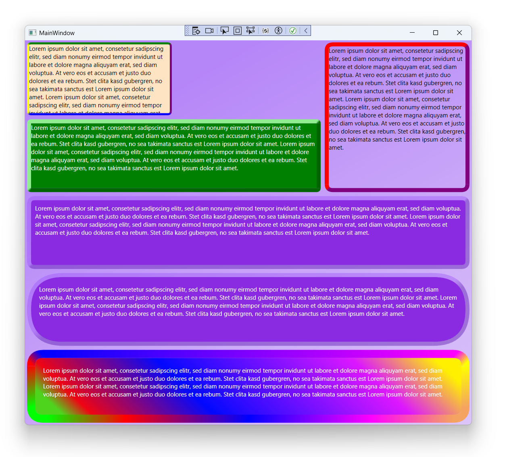

# Sundew.Xaml.Controls

## Controls:
* Border - A custom four-sided border, allowing some control over corner transitions.

### Examples:

### Known issues/Todo:
* DPI scaling?
* Drawing the corners so they align is hard, probably some better pixel alignment is needed.
* Only supports uniform Border thickness (How to immitate a variable sized Pen? when drawing borders)
* Port to WinUI, Avalonia, Maui?
* Performance optimizations