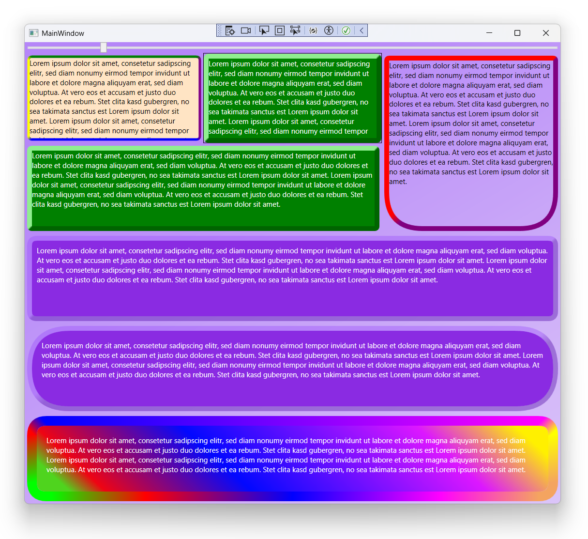

# Sundew.Xaml

## Controls:
* Border - A custom four-sided border, allowing some control over corner transitions.

## Theming:
* ThemeManager - A theme manager with support for themes and theme modes.
* ThemeResourceDictionary - A caching resource dictionary for managing themes.
* ThemeMoodeResourceDictionary - A caching resource dictionary for managing theme modes.

### Examples:

### Known issues/Todo:
* CornerRadius 0 is not properly supported.
* Only supports uniform Border thickness (How to immitate a variable sized Pen? when drawing borders)
* Port to WinUI, Avalonia, Maui?
* Performance optimizations